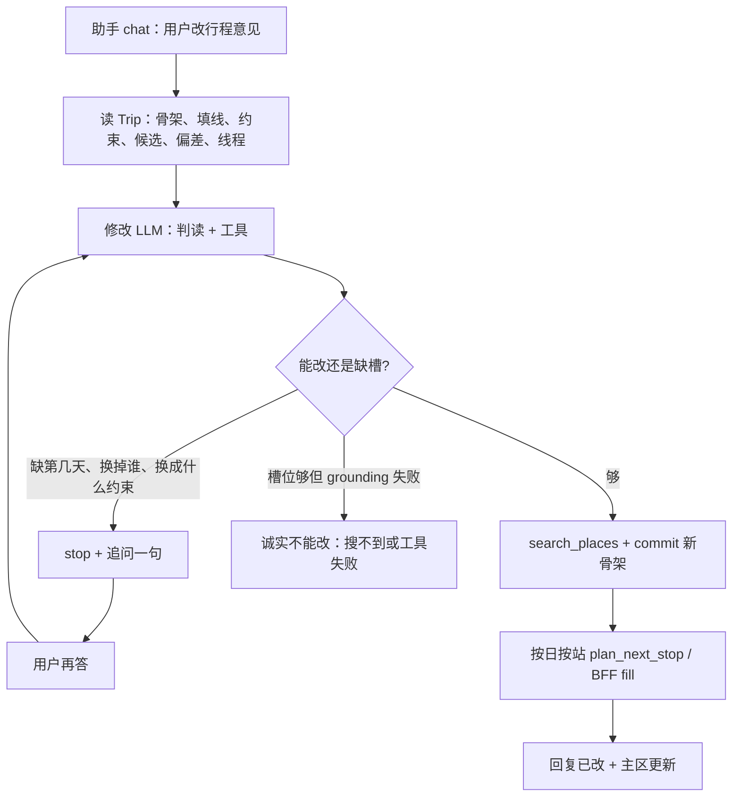

# plan_trip refine — 真智能体改行程（MVP-T9+）

**Status:** **Cancelled**（2026-09-18）— [ADR-071](../../adr/ADR-071-descope-in-page-refine-replan-only.md)；改行程 = Replan only。本文档保留作历史设计参考。  
**ADR:** [ADR-050](../../adr/ADR-050-where2play-no-product-llm.md) · ~~ADR-070~~ Cancelled  
**Supersedes（主路径）:** ops-first `commit_trip.operations[]` + `validateRequiredDropOperations` 作为 refine 主路径（ADR-070 D1）

---

## 原则

1. **Chat 是入口** — where2play 助手 composer 最后一条 user 整段作为 `refine.instruction`；2play **不**跑产品 LLM（ADR-050）。
2. **读 Trip 状态，不复制旧规划对话** — refine 环读 Trip Store：`constraints`、`skeleton`、`deviations`、`candidates`、`artifacts.filled_stops`、refine 线程；**不**持久化首次 `make_itinerary` 的 hidden chat（易过期、成本高）。
3. **真智能体判读** — 模型判断三种结局：**改** / **追问** / **诚实不能改**；代码不做「不去 X」正则意图闸。
4. **骨架优先，再 refill** — 与 T3 一致：先 commit **完整**新骨架 → 主区可见停点名变化 → 确定性触发 fill（仅变天）。
5. **Grounding 保留** — 新店名须来自 `search_places` / candidates（ADR-042）；这是能力边界，不是意图闸门。

---

## 目标循环

**「够不够」由模型判断。** 已含「第二天 + 上午 + 不去海洋公园 + 靠近下午」时，prompt 禁止再问哪一天哪个点。

---

## Agent 组装（与规划环同构）

仍是 **一个** `plan_trip` refine 环（MCP/HTTP `POST /v1/plan_trip`）；**不**新 MCP 工具名。where2play 只调 `/api/chat` → agent。

### Capabilities（3–5）

| # | 能力 | 说明 |
| --- | --- | --- |
| 1 | `search_places` | 新停点 grounding；可 `near` 已填坐标（上午 near 下午锚点等） |
| 2 | `commit_skeleton` | 写入**完整**新骨架（可沿用/扩展 `commit_trip`）；未改天数原样抄回 |
| 3 | `ask_user` / `stop(reply)` | 追问或说明；`changed: false`，行程不动 |
| 4 | （环外）Fill | **不在同一轮 LLM 里**逐步调 `plan_next_stop`；骨架 commit 成功后**确定性**触发 refill |

Fill 与现 `needs_refill` 相同：客户端 / BFF `planMode: fill`，只重填 **骨架 attraction 名相对旧骨架有变化的 `day_index`**（模型可改相邻天，diff 决定范围）。

### Knowledge 注入

- 当前骨架全文、`filled_stops` 时刻与坐标
- `deviations`（如 `far_cluster`）
- `candidates` 名单
- refine 线程（user/assistant 气泡）

原先「规划 LLM」= 上述状态 + 同一套 ontology / search 工具，**不是** replay 第一次规划对话。

### Prompt 要点

- 旅行约束 + 当前骨架/填线 + 偏差 + 用户句 + 线程
- **最小改动**：未提及的天/段原样抄回
- **Proximity**：「上午不去 X，换与下午较近」→ `search_places` near 下午锚；下午无必要时保持
- **Indoor**：「第 N 天改室内」→ indoor-biased query；范围由模型定（上午/下午/全天）
- **追问上限**：同一缺口最多问 2 次，然后诚实停

---

## BFF / 客户端契约（Target）

### Request（不变）

`POST /api/chat` → BFF 截断 transcript → 最后 user = `refine.instruction` → `plan_trip(refine)`。

### Response — 三态

| 结局 | `changed` | `needs_refill` | `reply` | 行程 |
| --- | --- | --- | --- | --- |
| **已改** | `true` | `true` | 模型说明改了什么 | 原 filled DTO；客户端 fill 变天 |
| **追问** | `false` | `false` | **模型追问句**（BFF 透传，**非** `refine_no_change`） | 原 itinerary 不变 |
| **诚实不能改** | `false` | `false` | 模型说明（搜不到/工具失败） | 原 itinerary 不变 |
| **真无操作**（用户确认不改） | `false` | `false` | `play.chat.refine_no_change` 或等价 | 原 itinerary 不变 |

**禁止：** `changed: false` 时一律盖 `play.chat.refine_no_change`（会吞掉模型追问）。

**禁止：** BFF `mergeRefineSkeletonIntoItinerary` 破坏性 merge（hotfix 已删；保持）。

### 客户端

- `refineSending` → `plan-nav-refine-progress`（线程顺序见 `2play-refine-thread`）
- `needs_refill` → `runFillFromSkeleton(planMode: fill)` → transit/meals 恢复
- 追问时不触发 fill；用户下一条 user 再进 refine 环

---

## 与 as-built（ops-patch）差异

| | as-built（2026-09-18） | Target（本稿） |
| --- | --- | --- |
| 主路径 | LLM 选 `remove/replace/swap` ops | LLM 输出完整新骨架 |
| 不够明确 | `validateRequiredDropOperations` + BFF `refine_no_change` | 模型追问，行程不动 |
| 店名 | grounding | **仍 grounding** |
| 填线 | patch 后 refill | skeleton commit 后按变天 refill |
| 2play LLM | 无 | 无 |

实现时：`plan-trip-refine.ts` 改 prompt + tools；弱化或移除 ops 主路径与硬闸；BFF 按上表分派 `reply`。

---

## 用户可见节奏（示例：上海 3 日亲子）

**够改：** 「第二天上午不去海洋公园，换一个与下午较近的地点」

1. 助手：进行中 → 骨架更新（第 2 天上午换 near 自然博物馆的 grounding 点）
2. 主区对该日（及模型改过的天） refill
3. 助手一句说明改了什么

**不够：** 「改近一点」

1. 助手追问：「改哪一天的上午还是下午？」
2. 行程不动；用户补充后再进环

---

## 风险与限制

- **整份骨架重写过头** — prompt 要求抄回未改天；commit 后 diff `day_index`  attraction 名决定 refill 范围
- **追问死循环** — 同一缺口最多 2 次
- **成本** — 一次骨架 LLM + 变天 fill（比单次 replace 贵；换「模型定范围」）
- **不持久化** — 完整 planning chat 不进 Trip；读账本即可

---

## 测试要点（实现后）

1. **够改** — Day 2 上午 drop + near afternoon → `changed: true` → fill 仅变天
2. **追问** — 「改近一点」→ `changed: false` + 模型追问文案（非 `refine_no_change`）
3. **grounding 失败** — 模型诚实不能改；骨架不变
4. **no-op 真无改** — 用户说「不用改了」→ `refine_no_change` 或等价
5. **BFF** — 不 merge skeleton 进 filled DTO；`needs_refill` 仅 `changed: true`
6. **线程** — 追问/成功/refill 后 transcript 顺序与 `2play-refine-thread` 一致

---

## 关联故事

- `agent-chat-93e`（as-built Done）→ **`agent-refine-true-agent`**（Target）
- `2play-plan-90e` / `chat-01` → **`2play-refine-true-agent`**（BFF reply 三态）
- 已有 hotfix：`2play-refine-hotfix`、`2play-refine-refill`、`2play-refine-thread`
